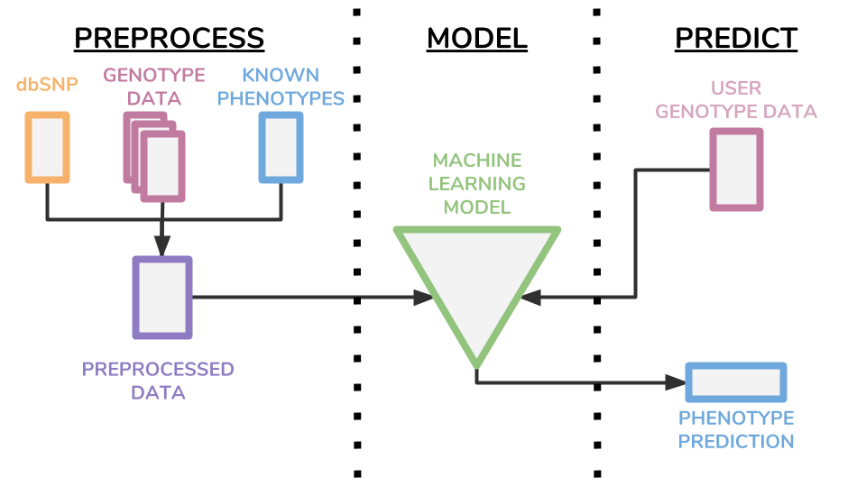
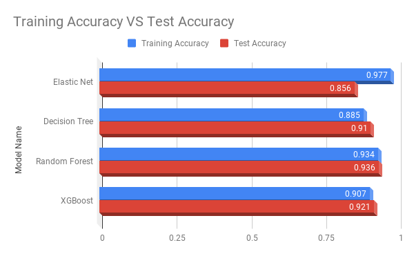

# Summary

This project applies machine learning to publicly available genomic data to predict phenotype and identify Single Nucleotide Polymorphisms (SNPs) that are most influential.
The method requires no domain knowledge and can be used with any binary phenotype classification.

The model correctly identified HERC2 as the most influential gene and identified the polygenic relationship between genes
HERC2 and OCA2.


# Prerequisites

## Python Packages

It is recommended to install this application in a virtual environment.
To create and activate the virtual environment run:

```commandline
# install virtualenv if it is not already installed
pip install virtualenv

# create virtualenv
virtualenv -p <python2.7 path> genopheno_ve
```

Activate the virtualenv on macOS and Linux.

```commandline
source genopheno_ve/bin/activate
```

Activate the virtualenv on Windows.

```commandline
genopheno_ve\Scripts\activate
```

From the repository directory, install the genopheno requirements.

```commandline
pip install -r requirements.txt
```

# Running with Sample Data

Out of the box, the application comes with sample data to predict eye color.

The commands in this section assume the virtual environment from the prerequisites step is activated and that the
current directory genopheno/genopheno (the root package directory).
Execute the following commands to use the sample data and default model settings.

```commandline
# Preprocess the data
python preprocess.py

# Build the model
python model.py

# Use the model to predict phenotypes
python predict.py
```

Note, there is not enough data to produce a well trained model.
The data is included as a quick way to understand how to run the application.

# Running the Application

The application is broken down into three steps, each with their own command-line interface.

1. Preprocessing the genomic data. This step converts user genotypes at each SNP to a mutation count.
2. Building the model. This step uses the preprocessed data to build a model to predict phenotype.
3. Using the model. This step uses the model from the previous step to predict phenotype for additional users.



The commands in this section assume the virtual environment from the prerequisites step is activated and that the
current directory genopheno/genopheno (the root package directory).

## Preprocessing

The application includes SNP data from [dbSNP](https://www.ncbi.nlm.nih.gov/projects/SNP/) that will be used for SNP
information by default. To run the application with a custom user set run:

```commandline
python preprocess.py --user-geno mydata/users --known-phenos mydata/phenos.csv
```

Additionally, to use custom SNP data run:

```commandline
python preprocess.py --user-geno mydata/users --known-phenos mydata/phenos.csv --snp mydata/snp
```

See the CLI for additional flags or refer to the table below.

```commandline
python preprocess.py --help
```

|Argument|Short|Description|
|:--|:--|:--|
|**--usergeno**|**-u**|The directory containing user genomic data. Each file contains data for one user. 23andMe and Ancestry.com data formats are supported.|
|**--known-phenos**|**-p**|The file path to the file that contains the known phenotypes. This is used to train the model. This must be a CSV file with the following format with columns user_id and phenotype.|
|**--snp**|**-s**|The directory containing the SNP data for each genome. The supported file format is VCF.|
|**--output**|**-o**|The directory that the out files should be written to. This will include all files required for the machine learning input.|

### Custom Input Data
User genomic file names must start with the numeric user ID followed by an underscore and end
with either 23andme.txt or ancestry.txt (i.e. user44_file19_yearofbirth_1970_sex_XY.23andme.txt).

The known phenotypes file must contain columns "user_id,phenotype". The user_id must be the numeric id that matches
the numeric id in the genomic file name (i.e. 44). The phenotype column can contain any binary phenotype classification
(i.e. blue_green/brown for eye color).


## Building the Model

To build the model, use the output of the preprocessed step. If no preprocessed directory is supplied it uses the default
output directory of the preprocess step.

SNPs are features in the model and are selected by identifying
significant mutation differences between the negative and positive phenotype classifications. The model includes
main effects for each selected SNP and optionally interaction effects between each selected SNP.

To build the model with a custom threshold for SNP selection and threshold for missing SNP data run:

```commandline
python model.py --absolute-diff-thresh 35 --invalid-snp-thresh 50
```

There are more flags to customize the model. See the CLI help.

```commandline
python model.py --help
```

|Argument|Short|Description|
|:--|:--|:--|
|**--preprocessed**|**-p**|The directory containing the output data from the initialization phase. Default: resources/full_data/preprocessed|
|**--invalid-snp-thresh**|**-it**|The maximum percentage of missing or invalid user observations a SNP can have before it is not considered as a feature in the model|
|**--invalid-user-thresh**|**-iu**|The maximum percentage of missing or invalid SNP observations a user can have before it is not considered as a valid example in the model.|
|**--relative-diff-thresh**|**-rdt**|The relative difference in percent of users with a particular genotype, used for SNP selection. SNPs will be selected such that the lower percent value between the two phenotype groups is less than or equal to (1 - (relative_diff_thresh/100)) * higher. |
|**--split**|**s**|The percentage of users to use as test data.|
|**--no-interactions**|**-ni**|If set then interactions will not be included in the model.|
|**--negative**|**-n**|The phenotype value that should be considered as the negative case.|
|**--max-snps**|**-ms**|The maximum number of SNPs to include in the model|
|**--model**|**-m**|The type of model to use.`en`=Elastic Net, `dt`=Decision Tree, `rf`=Random Forest. Default: `rf`, default: `xg`=XGBoost|
|**--cross-validation**|**-cv**|Number of folds for k-fold cross validation. Default: 3|
|**--output**|**-o**|The directory that the output files should be written to. This will include all files required for the machine learning input.|

### Output

After the model is built, if elastic net or xgboost is used, an ROC curve and confusion matrix will be written to the output directory (roc.png and confusion_matrix.txt) to evaluate the model.

For elastic net, decision tree, random forest, and xgboost the model features, sorted by influence, will be written to the output. For example:

```
intercept: [104.24800058]

feature,coefficient
rs693:rs223192,-62.9458112451
rs693:rs306967,-55.0389140668
rs693:rs557993,-54.4003899739
rs693:rs382266,-54.4003899739
```

### Current Models and their performance on train and test sets



|Model|Train Accuracy|Test Accuracy|
|:--|:--|:--|
|**Elastic Net**|**97.7**|**85.6**|
|**Decision Tree**|**88.5**|**91**|
|**Random Forest**|**93.4**|**93.6**|
|**XGBoost**|**90.7**|**92.1**|

## Using the Model

To build the model, use the output of the preprocessing and modeling steps. If no directories are supplied it uses the default
output directories of each step.

To prediction phenotypes for new users run:

```commandline
python predict.py --users-dir mydata/new_users
```

See the CLI for additional flags.

```commandline
python predict.py --help
```

|Argument|Short|Description|
|:--|:--|:--|
|**--users-dir**|**-u**|The directory that contains the users genomic data to predict the phenotypes for. Default: resources/data/users|
|**--init-dir**|**-i**|The directory that the preprocessed files are in. Default: resources/full_data/preprocessed|
|**--model-dir**|**-m**|The directory that the model files are in. Default: resources/data/model|
|**--output**|**-o**|The directory that the output files should be written to. Default: resources/data/prediction|


### Output

The predictions are written to the output directory (predictions.csv). For example:

```csv
user_id,prediction
1892,Blue_Green
189,Brown
200,Blue_Green
2064,Blue_Green
2074,Blue_Green
```

### Testing


```commandline
python tests/test_app.py
```

|Argument|Short|Description|
|:--|:--|:--|
|**--model**|**-m**|The type of model to use.`en`=Elastic Net, `dt`=Decision Tree, `rf`=Random Forest. Default: `rf`, default: `xg`=XGBoost|

### Important Notes

- Model currently runs on a full data set of 830 users
- Data folder only had all 830 users information already preprocessed
- So when running the preprocessing script, only the toy data of 23 users is processed
